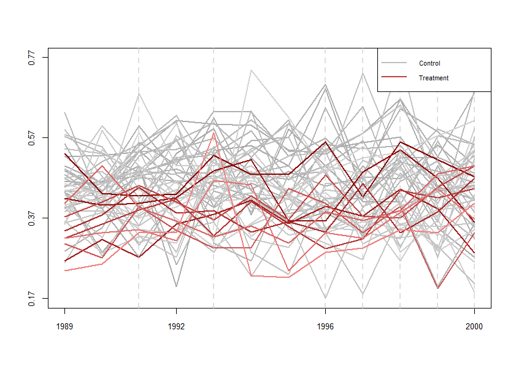
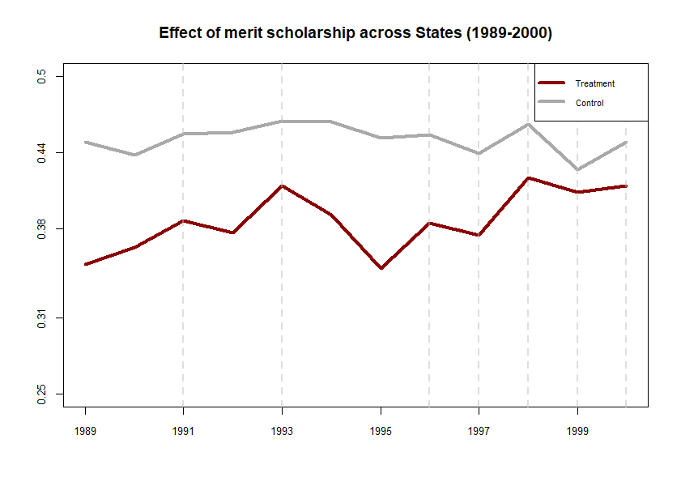

# undidRjl


## Installation 
```R
install.packages("devtools") # if devtools is not already installed
devtools::install_github("ebjamieson97/undidRjl") 
```

## Requirements
* JuliaCall package for R
* Julia 1.9.4 or later

JuliaCall and Julia itself can be downloaded by calling
```R
install.packages("JuliaCall") # installs JuliaCall
library(JuliaCall) # loads JuliaCall
install_julia() # installs Julia
```

### Utility Commands

#### 1. `checkundidversion()`

Checks and prints the currently installed and the latest version of Undid.jl package. If the installed version is out of date, it will prompt you to consider updating using the function `updateundid()`. If Undid.jl is not installed, installs Undid.jl.


#### 2. `updateundid()`

Updates Undid.jl to the latest version if Undid.jl is already installed.


## Stage One: Initialize

#### 3. `create_init_csv()` - Returns a dataframe and prints a filepath.

Generates an initial `.csv` file (`init.csv`) specifying the silo names, start times, end times, and treatment times. This file is then used to create the `empty_diff_df.csv`, which is sent to each silo. If `create_init_csv()` is called without providing any silo names, start times, end times, or treatment times, an `init.csv` will be created with the appropriate column headers and blank columns. 

Covariates may be specified when calling `create_init_csv()` or when calling `create_diff_df()`.

Ensure that dates are all entered in the same date format, a list of acceptable date formats can be seen [here.](#valid-date-formats)

**Arguments**:
- **`silo_names`** :: `character vector` or `NA` (default: `NA`) — A character vector of silo names, e.g., `c("71", "73")`.
- **`start_times`** :: `character vector` or `NA` (default: `NA`) — A character vector of start times corresponding to the silos.
- **`end_times`** :: `character vector` or `NA` (default: `NA`) — A character vector of end times corresponding to the silos.
- **`treatment_times`** :: `character vector` or `NA` (default: `NA`) — A character vector of treatment times, or `"control"` to indicate when treatment started for each silo.
  
- (optional) **`covariates`** :: `character vector` or `FALSE` (default: `FALSE`) — A character vector of covariates, or `FALSE` to exclude covariates.

**Examples**
```R
> create_init_csv(silo_names = c("ON", "QC"), start_times = c("2010", "2010"), end_times = c("2022", "2022"), treatment_times = c("control", "2016"))
init.csv saved to: C:/Users/User/Documents/init.csv 
  silo_name start_time end_time treatment_time
1        ON       2010     2022        control
2        QC       2010     2022           2016
```

#### 4. `create_diff_df()` - Returns a dataframe and prints a filepath.

Generates the `empty_diff_df.csv` file. The `empty_diff_df.csv` file is sent to each silo in order to be filled out.

Covariates may be specified when calling `create_init_csv()` or when calling `create_diff_df()`.

**Arguments**:
- **`filepath`** :: `character` — Filepath to the `init.csv`.
- **`date_format`** :: `character` — Specify the [format](#valid-date-formats) of the dates in the `init.csv`.
- **`freq`** :: `character` — Specify the frequency of the data to be analyzed ("daily", "weekly", "monthly", or "yearly").

- (optional) **`covariates`** :: `character vector` or `FALSE` (default: `FALSE`) — Vector of covariates or `FALSE` to use covariates found in the `init.csv`.
- (optional) **`freq_multiplier`** :: `integer` or `FALSE` (default: `FALSE`) — An integer, if required, to multiply with the freq (e.g. if you are analyzing data that is collected every 3 months you would set freq_multiplier = 3 and freq = "monthly")

**Examples**
```R
> create_diff_df("C:/Users/User/Documents/init.csv", "yyyy", "yearly")
empty_diff_df.csv saved to: C:/Users/User/Documents/empty_diff_df.csv 
  silo_name treat common_treatment_time start_time   end_time diff_estimate diff_var diff_estimate_covariates diff_var_covariates covariates date_format    freq
1        ON     0                  2016 2010-01-01 2022-01-01       missing  missing                  missing              missing       none        yyyy 1 year
2        QC     1                  2016 2010-01-01 2022-01-01       missing  missing                  missing              missing       none        yyyy 1 year 
```

## Stage Two: Silo

#### 5. `undid_stage_two()` - Returns a list of filepaths and dataframes.

The `undid_stage_two()` function uses date information from the `empty_diff_df.csv` and the local silo data to fill in the necessary diff_estimates.

Ensure that the `local_silo_name` reflects the spelling of the silo in the `empty_diff_df.csv` file. Likewise, ensure that the covariates specified in the `empty_diff_df.csv` are spelled the same in the local silo data.

Also be sure that the `time_column` contains only `character` values. This is in order to enable passing data back and forth between Julia and R. 

**Arguments**:
- **`filepath`** :: `character` — Filepath to the `empty_diff_df.csv`.
- **`silo_data`** :: `list` — Dataframe of the local silo data. 
- **`time_column`** :: `character` — Name of column where the time/date information is stored in the `silo_data`.
- **`outcome_column`** :: `character` — Name of column where the outcome of interest data is stored in the `silo_data`.
- **`local_date_format`** :: `character` — [Format](#valid-date-formats) of the dates in the `time_column`.
- (optional) **`consider_covariates`** :: `logical` (default: `TRUE`) — If set to `FALSE`, ignores carrying out the calculations to fill the column `diff_estimate_covariates`.

**Examples**
```R
silo_data <- read_dta("C:/Users/User/Documents/Data/QC.dta")
output <- undid_stage_two(filepath = "C:/Users/User/Downloads/empty_diff_df.csv", 
local_silo_name = "QC", 
silo_data = silo_data, 
time_column = "year", 
outcome_column = "coll", 
local_date_format = "yyyy")

# To view the filled_diff_data:
print(output[[1]][2])

# To view the trends_data
print(output[[2]][2])
```

## Stage Three: Analysis

#### 6. `undid_stage_three()` - Returns a dataframe of results. 

The `undid_stage_three()` function combines the `filled_diff_df.csv`'s and computes the aggregate ATT by silo, gvar, or (g,t).

If errors persist, check to see if there are missing `diff_estiamtes` in the `filled_diff_df.csv`'s. If so, try setting `interpolation = "linear_function"`.

**Arguments**:
- **`dir_path`** :: `character` — Filepath to folder containing all of the `filled_diff_df.csv`'s.
- **`agg`** :: `character` (default: `"silo"`) — The aggregation method. Either "silo", "g", or "gt".
- **`covariates`** :: `logical` (default: `FALSE`) — Indicate whether to consider covariates or not (i.e. use values from `diff_estimate` or `diff_estimate_covariates`).
- **`save_csv`** :: `logical` (default: `FALSE`) — Indicate whether or not to save the `combined_diff_data.csv`. The `UNDID_results.csv` is saved to the current working directory in any case.
- (optional) **`interpolation`** :: `character` or `FALSE` (default: `FALSE`) — Set to "linear_function" to fill in missing values of `diff_estimate` or `diff_estimate_covariates`.

**Examples**
```R
> undid_stage_three("C:\\Users\\User\\Documents\\FilledDiffData")

   silos       ATT_s    agg_ATT jackknife_SE p_value_RI
1     34 -0.06459396 0.03605769  0.005326418  0.1764706
2     57 -0.03469211         NA           NA         NA
3     58  0.02929645         NA           NA         NA
4     59  0.08529822         NA           NA         NA
5     61  0.01843108         NA           NA         NA
6     64    0.073632         NA           NA         NA
7     71  0.05986926         NA           NA         NA
8     72  0.08545259         NA           NA         NA
9     85  0.05545955         NA           NA         NA
10    88  0.05242378         NA           NA         NA
```

#### 7. `plot_parallel_trends()` - Returns combined trends data and displays plot. 

The `plot_parallel_trends()` function combines the trends_data.csv's and plots parallel trends figures. There are a plethora of options for this function. Many arguments are the same as those used in the base functions `plot()` and `axis()`. 

There are controls for tick marks, titles, point markers, line width, labels, colours, legend options, and more.

**Arguments**:
- **`dir_path`** :: `character` — A string filepath to folder containing all of the `trends_data.csv`s.
- (optional) **`covariates`** :: `logical` (default: `FALSE`) — Indicates whether or not to consider covariates.
- (optional) **`save_csv`** :: `logical` (default: `FALSE`) — Indicates whether or not to save the `combined_trends_data.csv`.
- (optional) **`combine`** :: `logical` (default: `FALSE`) — Indicates whether to plot each silo separately or to combine silos based on treatment status.
- (optional) **`pch`** :: `integer` or `integer vector` (default: `NA`) — Determines the points used on the plot (range: 0 to 25).
- (optional) **`pch_control`** :: `integer` or `integer vector` (default: `NULL`) — Determines the points used on the plot for control silos. Takes value of `pch` if `NULL`.
- (optional) **`pch_treated`** :: `integer` or `integer vector` (default: `NULL`) — Determines the points used on the plot for treated silos. Takes value of `pch` if `NULL`.
- (optional) **`control_colour`** :: `character vector` (default: `c("darkgrey", "lightgrey")`) — Option for control silos. If `combine = TRUE`, takes the 1st value to determine the colour of the control line.
- (optional) **`treatment_colour`** :: `character vector` (default: `c("darkred", "lightcoral")`) — Colour options for treatment silos. If `combine = TRUE`, takes the 1st value to determine the colour of the control line.
- (optional) **`lwd`** :: `integer` (default: `2`) — Specifies the line widths.
- (optional) **`xlab`** :: `character` (default: `NA`) — Label for the x-axis.
- (optional) **`ylab`** :: `character` (default: `NA`) — Label for the y-axis.
- (optional) **`title`** :: `character` (default: `NA`) — Title of the plot.
- (optional) **`xticks`** :: `integer` (default: `4`) — Number of ticks to display on the x-axis.
- (optional) **`date_format`** :: `character` (default: `"%Y"`) — Format for displaying dates along the x-axis.
- (optional) **`xdates`** :: `Date vector` (default: `NULL`) — Vector of dates to display along the x-axis.
- (optional) **`xaxlabsz`** :: `double` (default: `0.8`) — Size of x-axis labels.
- (optional) **`save_png`** :: `logical` (default: `FALSE`) — Indicates whether to save the plot as a PNG file.
- (optional) **`width`** :: `integer` — Width of the saved PNG file.
- (optional) **`height`** :: `integer` — Height of the saved PNG file.
- (optional) **`ylim`** :: `double vector` — Min and max range for the y-axis (defaults to the min and max values in the y column of trends_data).
- (optional) **`yaxlabsz`** :: `double` (default: `0.8`) — Size of y-axis labels.
- (optional) **`ylabels`** :: `double vector` (default: `NULL`) — Values to appear on the y-axis.
- (optional) **`yticks`** :: `integer` (default: `4`) — Number of values to display along the y-axis.
- (optional) **`ydecimal`** :: `integer` — Decimal point rounding for y-axis values.
- (optional) **`legend_location`** :: `character` (default: `topright`) — Location of the legend.
- (optional) **`simplify_legend`** :: `logical` (default: `TRUE`) — If `TRUE`, shows one colour for treatment and control silos in the legend.
- (optional) **`legend_text`** :: `double` (default: `0.7`) — Size of text in the legend.
- (optional) **`legend_on`** :: `logical` (default: `TRUE`) — Whether to display the legend.
- (optional) **`treatment_indicator_col`** :: `character` (default: `"grey"`) — Colour for the dashed vertical treatment indicator line.
- (optional) **`treatment_indicator_alpha`** :: `double` (default: `0.5`) — Transparency level for the treatment indicator lines.
- (optional) **`treatment_indicator_lwd`** :: `double` (default: `2`) — Line width of the treatment indicator lines.
- (optional) **`treatment_indicator_lty`** :: `integer` (default: `2`) — Line type (lty) for the treatment indicator lines.


**Examples**
```R
plot_parallel_trends("C:\\Users\\User\\Documents\\FilledTrendsData")
```


```R
plot_parallel_trends("C:\\Users\\User\\Documents\\FilledTrendsData",
                     combine = TRUE,  # Combine all the treated and control silos together
                     ylim = c(0.25,0.5), # Set the limits of the y-axis
                     ylabels = c(0.25, 0.31, 0.38, 0.44, 0.50), # Specify the y-values that are shown on the y-axis
                     xdates = c("1989-01-01", "1991-01-01", "1993-01-01", "1995-01-01", "1997-01-01", "1999-01-01"), # Specify the dates that show up along the x-axis
                     title = "Effect of merit scholarship across States (1989-2000)", # Give the plot a title
                     lwd = 4) # Set the linewidth
```



## Appendix

#### Valid Date Formats
- `ddmonyyyy` → 25aug1990
- `yyyym00` → 1990m8
- `yyyy/mm/dd` → 1990/08/25
- `yyyy-mm-dd` → 1990-08-25
- `yyyymmdd` → 19900825
- `yyyy/dd/mm` → 1990/25/08
- `yyyy-dd-mm` → 1990-25-08
- `yyyyddmm` → 19902508
- `dd/mm/yyyy` → 25/08/1990
- `dd-mm-yyyy` → 25-08-1990
- `ddmmyyyy` → 25081990
- `mm/dd/yyyy` → 08/25/1990
- `mm-dd-yyyy` → 08-25-1990
- `mmddyyyy` → 08251990
- `mm/yyyy` → 08/1990
- `mm-yyyy` → 08-1990
- `mmyyyy` → 081990
- `yyyy` → 1990

